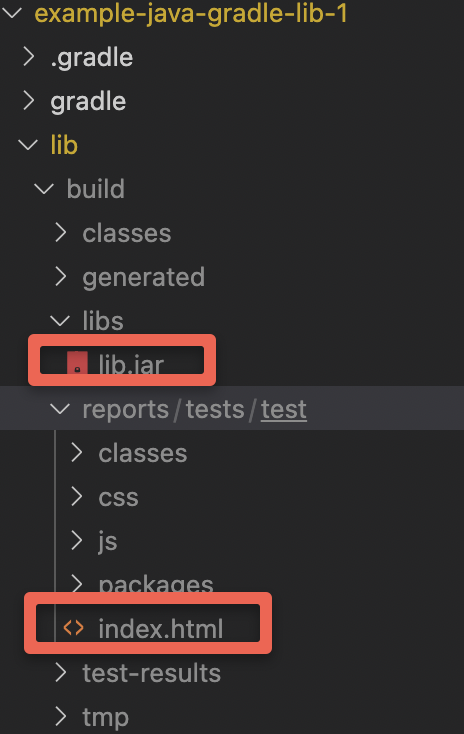
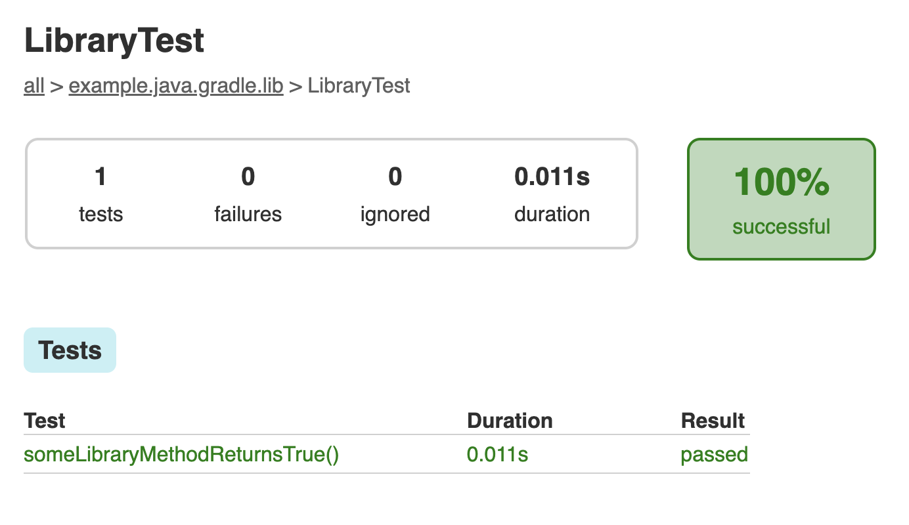

# Example Java Library using Gradle: Part 1

The purpose of this project is to be a basic Java library that is built using Gradle, with the intention of adding to it common software utilities step by step.

Prerequisites

- Git Setup: https://github.com/jvalentino/setup-git
- Building Java 101: https://github.com/jvalentino/java-building-101

## Java-Gradle 101


Reference: https://docs.gradle.org/current/userguide/java_plugin.html

## Building it

The important step here, is how to run the build which includes any associated testing, other automation, and ultimatley builds the jar file:

```bash
$ ./gradlew clean build -i
> Configure project :lib
> Task :lib:clean
> Task :lib:compileJava
> Task :lib:processResources NO-SOURCE
> Task :lib:classes
> Task :lib:jar
> Task :lib:assemble
> Task :lib:compileTestJava
> Task :lib:processTestResources NO-SOURCE
> Task :lib:testClasses
> Task :lib:test
> Task :lib:check
> Task :lib:build

BUILD SUCCESSFUL in 919ms
5 actionable tasks: 5 executed
```

Specifically, you get this output:



lib/build/lib.jar is the underlying java library that was build, while the index.html file is a detailed report on all the unit testing:



## Wait, how does all this work?

Gradle.

Specifically Gradle is a technology that works on the principal of "convention over configuration", which is a basic way of saying for anything you are building/deliverying there is an assumed convention, and as such you should only have to declare code for when you deviate from that convention.

Well mostly, as there is some boiletplate stuff you still have to declare.

### settings.gradle

```groovy
rootProject.name = 'example-java-gradle-lib-1'
include('lib')
```

The purpose of this file is give a name for the underlying project, and to specify the different source code directories that represent what is being build. In the case that we are building just a library, it has its own specific build setting in the lib directory, so that is what we include.

**Sidebar on Multi-Project**

This means that multi-directoy/muti-thing projects are supported by default, however I will strongly caution you from using them. If you make a project consists of two libraries, both of those libraries are tightly coupled together, which defeats the purpose of having them separate in the first place. Having a multi-project repository is sometimes a good first step, when figuring out how to bring something up. However, the next step is to take what you broke it and put it in its own library/app.

### lib/build.gradle

This is where the real magic happens:

```groovy
plugins {
    // Apply the java-library plugin for API and implementation separation.
    id 'java-library'
}

repositories {
    // Use Maven Central for resolving dependencies.
    mavenCentral()
}

dependencies {
    // Use JUnit Jupiter for testing.
    testImplementation 'org.junit.jupiter:junit-jupiter:5.9.1'

    // This dependency is exported to consumers, that is to say found on their compile classpath.
    api 'org.apache.commons:commons-math3:3.6.1'

    // This dependency is used internally, and not exposed to consumers on their own compile classpath.
    implementation 'com.google.guava:guava:31.1-jre'
}

tasks.named('test') {
    // Use JUnit Platform for unit tests.
    useJUnitPlatform()
}
```

At the top we are applying an existing core plugin called `java-libary`. By including this plugin, we immediately inherit an entire build lifecycle for building a reusable Java library. That is where all those tasks came from in the start where we ran `./gradlew build`.

The `repositories` section is used for declating the remote location that contain the dependencies you need, later declared in the `dependencies` section.

The `dependencies` seciton is where you refer to the libraries you want to use to build what you are building. For the moment the 3 important types of dependencies are:

- testImplementation - Means that something is needed for executing test classes, and is therefore not needed in the actual running of the application
- implementation - This dependency is used internally, and not exposed to consumers on their own compile classpath.
- api - This dependency is exported to consumers, that is to say found on their compile classpath.

The final section stating `tasks.named('test')`, is override the behavior of all tests that are named test to use the JUNit testing platform.

# FAQ

## How did I create this initial project?

```bash
~/workspaces/personal/example-java-gradle-lib-1 $ gradle init
Starting a Gradle Daemon, 1 incompatible Daemon could not be reused, use --status for details

Select type of project to generate:
  1: basic
  2: application
  3: library
  4: Gradle plugin
Enter selection (default: basic) [1..4] 3

Select implementation language:
  1: C++
  2: Groovy
  3: Java
  4: Kotlin
  5: Scala
  6: Swift
Enter selection (default: Java) [1..6] 3

Select build script DSL:
  1: Groovy
  2: Kotlin
Enter selection (default: Groovy) [1..2] 1

Generate build using new APIs and behavior (some features may change in the next minor release)? (default: no) [yes, no] 

Select test framework:
  1: JUnit 4
  2: TestNG
  3: Spock
  4: JUnit Jupiter
Enter selection (default: JUnit Jupiter) [1..4] 4

Project name (default: example-java-gradle-lib-1): 
Source package (default: example.java.gradle.lib): 

> Task :init
Get more help with your project: https://docs.gradle.org/7.6/samples/sample_building_java_libraries.html

BUILD SUCCESSFUL in 29s
2 actionable tasks: 2 executed
```

## How did I generate the Gradle Wrapper?

```bash
$ gradle wrapper
```

